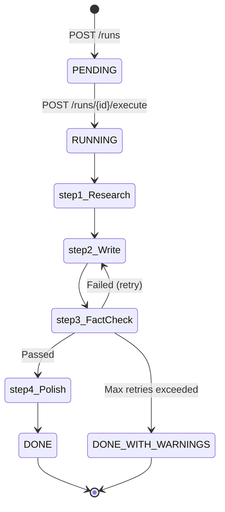

# 📚 FactFlow AI – Detailed Documentation

> **Comprehensive guide to architecture, implementation, and deployment**

---

## Table of Contents

1. [System Architecture](#system-architecture)
2. [Advanced Features](#advanced-features)
3. [Agent Pipeline Deep Dive](#agent-pipeline-deep-dive)
4. [Data Flow & Storage](#data-flow--storage)
5. [API Reference](#api-reference)
6. [Frontend Components](#frontend-components)
7. [Configuration & Tuning](#configuration--tuning)
8. [Production Deployment](#production-deployment)
9. [Troubleshooting & FAQ](#troubleshooting--faq)
10. [Development Roadmap](#development-roadmap)

---

## System Architecture

### High-Level Overview

```
┌─────────────────────────────────────────────────────────────────┐
│                         User Interface                          │
│                      (Next.js 14 Frontend)                      │
│                                                                 │
│  ┌────────────┐  ┌──────────────┐  ┌────────────────────────┐ │
│  │ PRD Input  │  │   Timeline   │  │   Download Center     │ │
│  │   Form     │  │   Viewer     │  │  (.md / .json)        │ │
│  └────────────┘  └──────────────┘  └────────────────────────┘ │
└───────────────────────────┬─────────────────────────────────────┘
                            │ HTTP (REST API)
┌───────────────────────────▼─────────────────────────────────────┐
│                      FastAPI Backend                            │
│                                                                 │
│  ┌──────────────┐  ┌────────────────────┐  ┌────────────────┐ │
│  │   Routes     │  │   Orchestrator     │  │   Run Store    │ │
│  │  (main.py)   │──│  (Pipeline Logic)  │──│ (JSON Files)   │ │
│  └──────────────┘  └────────────────────┘  └────────────────┘ │
│                            │                                    │
│                            ▼                                    │
│  ┌──────────────────────────────────────────────────────────┐  │
│  │              CrewAI Multi-Agent System                   │  │
│  │                                                           │  │
│  │  ┌──────────┐  ┌────────┐  ┌──────────┐  ┌───────────┐ │  │
│  │  │Researcher│─▶│ Writer │─▶│  Fact    │─▶│  Style    │ │  │
│  │  │  Agent   │  │ Agent  │  │ Checker  │  │  Editor   │ │  │
│  │  └──────────┘  └────────┘  └──────────┘  └───────────┘ │  │
│  │       │            │             │             │        │  │
│  │       └────────────┴─────────────┴─────────────┘        │  │
│  │                       │                                  │  │
│  └───────────────────────┼──────────────────────────────────┘  │
│                          │                                     │
└──────────────────────────┼─────────────────────────────────────┘
                           │
                ┌────────────▼────────────┐
                │   LLM Provider          │
                │   (LiteLLM Proxy)       │
                │                         │
                │ Groq Models:            │
                │ • llama-3.1-8b-instant  │
                │ • llama-3.3-70b-versatile│
                │ • llama-4-scout-17b     │
                │                         │
                │ Gemini Models:          │
                │ • gemini-2.5-flash      │
                │ • gemini-1.5-flash      │
                │ • gemini-1.5-pro        │
                │                         │
                │ (user selects per-run)  │
                └─────────────────────────┘
```

### Technology Stack Details

#### Backend Stack
- **FastAPI 0.115.0** – Chosen for async support, auto-generated OpenAPI docs, and type safety with Pydantic
- **CrewAI 0.80.0** – Multi-agent framework with YAML-based configuration and @CrewBase decorator pattern
- **LiteLLM** – Unified interface for multiple LLM providers with automatic retries
- **Groq API** – Ultra-fast LLM inference (up to 1000+ tokens/sec on llama-3.3-70b) - No function calling support
- **Google Gemini API** – Function calling support for web search tools (gemini-2.5-flash, gemini-1.5-flash, gemini-1.5-pro)
- **SerperDevTool** – Google Search API wrapper for web research (only works with Gemini models)
- **PyPDF2** – PDF text extraction for file uploads
- **EasyOCR** – Image OCR for extracting text from uploaded images (PNG, JPG, JPEG)
- **WeasyPrint** – HTML to PDF conversion for blog post exports

#### Frontend Stack
- **Next.js 14.2.15 (App Router)** – React framework with server components, streaming, and built-in routing
- **TypeScript 5** – Full type safety across client/server boundary
- **Tailwind CSS 3.4.13** – Utility-first CSS with JIT compilation
- **react-markdown + remark-gfm** – GitHub Flavored Markdown rendering with syntax highlighting support

#### Infrastructure
- **Local JSON Storage** – Simple, hackathon-friendly persistence (easily upgradeable to PostgreSQL/MongoDB)
- **CORS Middleware** – Secure cross-origin requests between frontend (port 3000) and backend (port 8000)
- **asyncio + ThreadPoolExecutor** – Hybrid concurrency model for CPU-bound LLM calls

---

## Advanced Features

### 1. File Upload System

**Supported Formats:**
- **PDF Files** – Extracted via PyPDF2, preserves text content
- **Text Files** (.txt, .md) – Direct text reading
- **Images** (PNG, JPG, JPEG) – OCR via EasyOCR to extract text from screenshots/diagrams

**Implementation:**
```python
# Backend endpoint
@app.post("/upload")
async def upload_file(file: UploadFile):
    if file.content_type == "application/pdf":
        # Extract text via PyPDF2
        reader = PdfReader(BytesIO(content))
        text = "\\n".join([page.extract_text() for page in reader.pages])
    elif file.content_type.startswith("image/"):
        # OCR with EasyOCR
        reader = easyocr.Reader(['en'])
        result = reader.readtext(image_array)
        text = "\\n".join([detection[1] for detection in result])
    return {"text": text, "filename": file.filename}
```

**Usage:** Click "📁 Upload File" button → Select file → PRD text area auto-fills with extracted content

---

### 2. Template Library

**Pre-built PRD Examples:**
1. **Task Management App** (127 words) – Mobile productivity tool
2. **AI Writing Assistant** (156 words) – Chrome extension for content improvement
3. **Analytics Dashboard** (234 words) – Real-time data visualization platform
4. **E-Learning Platform** (312 words) – Course delivery system with video support
5. **Enterprise CRM** (502 words) – Customer relationship management with AI features

**Purpose:**
- Quick demo/testing without manual PRD creation
- Reference examples for PRD structure
- Diverse complexity levels (100-500 words)

**Implementation:**
```typescript
// frontend/lib/templates.ts
export const TEMPLATES: Template[] = [
  {
    id: "task-management",
    name: "Task Management App",
    description: "Mobile productivity tool with gamification",
    content: "...",
    wordCount: 127
  },
  // ...
];
```

---

### 3. PDF Export with Styling

**Features:**
- Professional typography (system fonts: Georgia, Arial)
- Styled headings (H1: 28px, H2: 22px, H3: 18px)
- Preserved citations in footnote format
- Automatic page breaks and margins
- Syntax highlighting for code blocks

**Tech Stack:**
```python
# Backend: WeasyPrint for HTML → PDF
from weasyprint import HTML, CSS

html_template = f"""
<!DOCTYPE html>
<html>
<head>
  <style>
    body {{ font-family: Georgia, serif; line-height: 1.6; max-width: 800px; margin: 40px auto; }}
    h1 {{ font-size: 28px; color: #1a202c; margin-top: 0; }}
    h2 {{ font-size: 22px; color: #2d3748; border-bottom: 2px solid #e2e8f0; }}
    code {{ background: #f7fafc; padding: 2px 6px; border-radius: 3px; }}
  </style>
</head>
<body>{markdown_to_html(content)}</body>
</html>
"""
pdf_bytes = HTML(string=html_template).write_pdf()
```

**Windows Limitation:** Requires GTK+ runtime (see troubleshooting section)

---

### 4. Pipeline Stage Editing

**NEW: Feedback & Re-run Feature**

Users can now provide feedback at any stage and re-run the pipeline from that point forward!

**How It Works:**

1. **Feedback Modal:**
   ```typescript
   // Click "✏️ Edit" button on any completed stage
   <FeedbackModal
     isOpen={true}
     stageName="writer"
     stageTitle="Writer"
     onSubmit={(feedback) => submitFeedback(runId, "writer", feedback)}
   />
   ```

2. **Backend Re-run Logic:**
   ```python
   @app.post("/runs/{run_id}/feedback")
   async def submit_feedback(run_id: str, req: SubmitFeedbackRequest):
       # Stage: "researcher", "writer", "fact_checker", or "style_editor"
       # Re-run from that stage forward with user feedback
       result = await run_pipeline_with_feedback(run_id, state, store, stage, feedback)
   ```

3. **Re-execution Flow:**
   - **Researcher feedback:** Re-runs researcher → writer → fact-checker → style editor
   - **Writer feedback:** Re-runs writer → fact-checker → style editor (keeps research)
   - **Fact-checker feedback:** Re-runs fact-checker → style editor (keeps draft)
   - **Style editor feedback:** Re-runs style editor only

**Use Cases:**
- "Add more technical depth to the research"
- "Make the tone more casual and friendly"
- "Fix the citation format issues"
- "Polish the introduction paragraph"

---

## Agent Pipeline Deep Dive

### 1. Researcher Agent

**Role:** Extract structured facts and sources from the PRD

**Input:**
```typescript
{
  prd_text: string,      // User-provided PRD
  tone: string,          // professional/friendly/playful/academic/casual
  audience: string,      // Target reader persona
  word_count: number,    // 200-3000
  enable_search: boolean // Web search toggle
}
```

**Process:**
1. If `enable_search === true` && `SERPER_API_KEY` is set:
   - Generate 2-3 search queries based on key concepts in PRD
   - Execute SerperDevTool to fetch top Google results
   - Extract snippets from search results
2. Analyze PRD text to identify:
   - Key features and capabilities
   - Technical specifications
   - User benefits and use cases
   - Unknowns or ambiguities
3. Structure output as JSON with source IDs (S0, S1, S2...)

**Output Schema:**
```json
{
  "queries": ["search query 1", "search query 2"],
  "sources": [
    {
      "id": "S0",
      "title": "PRD Document",
      "url": "internal",
      "key_facts": ["fact 1", "fact 2", "..."]
    },
    {
      "id": "S1",
      "title": "External Article Title",
      "url": "https://example.com/article",
      "key_facts": ["fact A", "fact B", "..."]
    }
  ],
  "summary_facts": ["Overall fact 1", "Overall fact 2"],
  "unknowns": ["Unclear aspect 1", "Missing detail 2"]
}
```

**Key Implementation Detail:** The task prompt explicitly requires output in JSON format. The `json_guardrails.py` utility uses multiple parsing strategies:
1. Direct `json.loads()` attempt
2. Extract content from ```json``` code blocks
3. Regex extraction of first `{...}` object

**Temperature:** 0.5 (balanced creativity for query generation + factual extraction)

---

### 2. Writer Agent

**Role:** Draft a blog post with inline source citations

**Input:**
```python
{
  "prd_text": str,
  "research_output": ResearchOutput,  # From Researcher
  "tone": str,
  "audience": str,
  "word_count": int,
  "revision_instructions": Optional[str]  # From Fact-Checker if rewrite needed
}
```

**Process:**
1. Analyze research output to understand key themes
2. Structure blog post following standard format:
   - **Engaging headline** (H1)
   - **Introduction** (hook + problem statement)
   - **Body** (2-4 sections covering features/benefits/use cases)
   - **Conclusion** (call-to-action or summary)
3. For every factual claim, add inline citation: `This feature increases productivity by 40% [S1].`
4. If `revision_instructions` provided (from failed fact-check):
   - Focus on correcting flagged claims
   - Preserve existing valid citations
   - Add missing citations where needed

**Output:** 
Markdown-formatted blog post (950-3200 words depending on `word_count` setting)

**Citation Format Rules:**
- Must use square brackets: `[S0]`, `[S1]`, `[S2]`
- Can stack multiple sources: `[S0][S2]`
- Must cite immediately after claim, not at paragraph end
- Source IDs must match research output exactly

**Temperature:** 0.5 (creative for engaging prose, but still grounded in facts)

**Token Optimization:**
- Task prompt reduced from 800 → 250 tokens
- Backstory reduced from 150 → 25 tokens
- Uses bullet points instead of paragraphs in instructions

---

### 3. Fact-Checker Agent

**Role:** Validate every claim against sources and flag issues

**Input:**
```python
{
  "draft_blog": str,           # Markdown from Writer
  "research_output": ResearchOutput,
  "iteration": int             # Current retry count (1-3)
}
```

**Process:**
1. **Citation Coverage Check:**
   - Extract all `[S#]` citations from draft
   - Verify each cited source ID exists in research output
   - Flag uncited claims (statements without `[S#]`)

2. **Claim Verification:**
   - For each factual statement with citation, check if claim is supported by the source's `key_facts`
   - Identify: **Unsupported claims** (cite source that doesn't back the claim), **Exaggerated claims** (overstates what source says), **Missing context** (claim is true but needs qualifier)

3. **Issue Classification:**
   - **Critical:** False claims or uncited major statements
   - **Major:** Misleading/exaggerated claims
   - **Minor:** Missing nuance or context

4. **Generate Rewrite Instructions:**
   If issues found, provide specific guidance:
   ```
   - Line 23: "40% productivity increase" – no source supports this; remove or find citation
   - Line 47: "industry-standard security" – too vague, specify which standards
   ```

**Output Schema:**
```json
{
  "passed": false,
  "issues": [
    {
      "severity": "critical",
      "claim": "The exact claim text",
      "reason": "Why this is problematic",
      "suggestion": "How to fix it"
    }
  ],
  "rewrite_instructions": "Detailed paragraph for Writer agent..."
}
```

**Temperature:** 0.2 (strictest setting for consistent, conservative validation)

**Loop Logic (in orchestrator.py):**
```python
iteration = 1
while iteration <= MAX_FACT_CHECK_RETRIES (3):
    draft = kickoff_writer_task(...)
    fact_check = kickoff_fact_checker_task(draft, iteration=iteration)
    
    if fact_check["passed"]:
        break  # Success!
    
    # Failed – prepare revision instructions
    revision_instructions = build_revision_prompt(fact_check["issues"])
    iteration += 1

if iteration > MAX_FACT_CHECK_RETRIES:
    # Proceed with warnings
    status = "DONE_WITH_WARNINGS"
```

---

### 4. Style Editor Agent

**Role:** Polish clarity, tone, and readability WITHOUT changing facts

**Input:**
```python
{
  "draft_blog": str,       # Final draft from Writer
  "tone": str,
  "audience": str
}
```

**Process:**
1. **Readability Improvements:**
   - Simplify complex sentences
   - Break up long paragraphs
   - Add transition phrases between sections

2. **Tone Consistency:**
   - Verify language matches selected tone (professional vs. friendly vs. playful)
   - Adjust vocabulary for target audience (engineers vs. business leaders vs. students)

3. **Structural Polish:**
   - Ensure headline is compelling
   - Check that conclusion includes clear takeaway
   - Verify logical flow of sections

4. **Citation Preservation:**
   - **CRITICAL RULE:** Do NOT remove or modify `[S#]` citations
   - Do NOT add new facts (only clarify existing ones)
   - Do NOT introduce claims requiring new citations

**Output:**
Polished Markdown blog post (same structure as input, enhanced clarity)

**Temperature:** 0.5 (balanced for stylistic creativity within constraints)

**Safety Check:**
The orchestrator compares citation counts before/after polishing. If citations decrease, it logs a warning but still accepts the output (assumes agent had valid reason, e.g., removing redundant citations).

---

## Data Flow & Storage

### Run Lifecycle



### File Structure

Each run creates an isolated directory:
```
backend/data/runs/{run_id}/
├── state.json         # Complete run state (see schema below)
└── logs.txt           # Timestamped execution logs
```

**state.json Schema:**
```typescript
{
  run_id: string,              // UUID v4
  config: {
    prd_text: string,
    tone: string,
    audience: string,
    word_count: number,
    enable_search: boolean
  },
  status: "PENDING" | "RUNNING" | "DONE" | "DONE_WITH_WARNINGS" | "FAILED",
  created_at: string,          // ISO 8601 timestamp
  updated_at: string,
  
  steps: {
    step1_research: {
      status: "pending" | "running" | "completed" | "failed",
      started_at: string?,
      completed_at: string?,
      research_output: ResearchOutput?,  // JSON object
      raw_output: string?,               // LLM text response
      error: string?
    },
    step2_write: {
      // Same structure
      drafts: [                  // Array of iterations
        {
          iteration: 1,
          content: "# Markdown...",
          word_count: 1234,
          revision_instructions: null
        },
        {
          iteration: 2,
          content: "# Updated markdown...",
          word_count: 1256,
          revision_instructions: "Fix line 23..."
        }
      ]
    },
    step3_fact_check: {
      // Same structure
      fact_check_iterations: [
        {
          iteration: 1,
          passed: false,
          issues: [...],
          checked_draft_iteration: 1
        }
      ]
    },
    step4_polish: {
      // Same structure
      final_blog: "# Final markdown..."
    }
  },
  
  citations: [
    {
      id: "S0",
      title: "PRD Document",
      url: "internal"
    }
  ]
}
```

### Storage Operations

**RunStore Class (backend/app/services/run_store.py):**

| Method | Purpose | Side Effects |
|--------|---------|--------------|
| `init_run(config)` | Create new run directory + state.json | Writes `state.json` with PENDING status |
| `load(run_id)` | Read state.json for given run | None (read-only) |
| `update(run_id, data)` | Merge partial updates into state | Overwrites `state.json`, updates `updated_at` |
| `update_steps(run_id, steps)` | Update just the `steps` section | Partial write to `steps` field |
| `append_step(run_id, step_key, data)` | Add data to specific step (e.g., append draft) | Merges into `steps[step_key]` |
| `set_status(run_id, status)` | Change top-level status | Updates `status` + `updated_at` |
| `set_citations(run_id, sources)` | Store final source list | Updates `citations` array |
| `log(run_id, message)` | Append timestamped log entry | Appends to `logs.txt` |

**Concurrency Model:**
- Each API request creates a new thread for LLM execution (via `ThreadPoolExecutor`)
- File writes are serialized (no concurrent writes to same `state.json`)
- Frontend polls `/runs/{id}` every 3 seconds while `status === "RUNNING"`

---

## API Reference

### Base URL
- **Local Development:** `http://localhost:8000`
- **Production:** `https://your-domain.com/api`

### Authentication
None required (stateless API, no user accounts)

### Endpoints

#### 1. Create Run
```http
POST /runs
Content-Type: application/json

{
  "prd_text": "Your PRD content here...",
  "tone": "professional",
  "audience": "software engineers",
  "word_count": 1000,
  "enable_search": false
}
```

**Response (201 Created):**
```json
{
  "run_id": "550e8400-e29b-41d4-a716-446655440000",
  "status": "PENDING"
}
```

**Error Responses:**
- **422 Unprocessable Entity** – Invalid request body (e.g., `word_count` out of range 200-3000)
- **500 Internal Server Error** – Failed to create run directory

---

#### 2. Execute Run
```http
POST /runs/{run_id}/execute
```

**Response (202 Accepted):**
```json
{
  "run_id": "550e8400-e29b-41d4-a716-446655440000",
  "status": "RUNNING"
}
```

Initiates the 4-agent pipeline asynchronously. Frontend should poll `/runs/{run_id}` to track progress.

**Error Responses:**
- **404 Not Found** – Run ID doesn't exist
- **409 Conflict** – Run already executing or completed
- **500 Internal Server Error** – Pipeline execution error

---

#### 3. Get Run Status
```http
GET /runs/{run_id}
```

**Response (200 OK):**
```json
{
  "run_id": "550e8400-e29b-41d4-a716-446655440000",
  "config": { /* original config */ },
  "status": "RUNNING",
  "created_at": "2024-01-15T10:30:00Z",
  "updated_at": "2024-01-15T10:31:45Z",
  "steps": {
    "step1_research": {
      "status": "completed",
      "started_at": "2024-01-15T10:30:05Z",
      "completed_at": "2024-01-15T10:30:32Z",
      "research_output": { /* ResearchOutput JSON */ }
    },
    "step2_write": {
      "status": "running",
      "started_at": "2024-01-15T10:30:35Z",
      "drafts": [
        {
          "iteration": 1,
          "content": "# Draft blog post...",
          "word_count": 987
        }
      ]
    },
    "step3_fact_check": { "status": "pending" },
    "step4_polish": { "status": "pending" }
  },
  "citations": []
}
```

**Polling Strategy:**
```typescript
const pollInterval = 3000; // 3 seconds

const poll = async () => {
  const response = await fetch(`/api/backend/runs/${runId}`);
  const data = await response.json();
  
  if (data.status === "RUNNING") {
    setTimeout(poll, pollInterval);
  } else {
    // Done or failed – stop polling
  }
};
```

**Error Responses:**
- **404 Not Found** – Run ID doesn't exist

---

## Frontend Components

### Architecture

```
app/
├── page.tsx                    # Home page (PRD input form)
├── runs/[runId]/
│   └── page.tsx                # Timeline viewer (dynamic route)
└── layout.tsx                  # Root layout

components/
├── Timeline.tsx                # 4-step vertical timeline
├── StepCard.tsx                # Collapsible card for each agent step
├── SourcesList.tsx             # Research sources table
├── IssuesTable.tsx             # Fact-check issues table
├── MarkdownViewer.tsx          # Blog preview with syntax highlighting
└── StatusBadge.tsx             # Color-coded status indicator

lib/
├── api.ts                      # Backend API client
└── types.ts                    # TypeScript interfaces (mirrors backend schemas)
```

### Key Component Details

#### Timeline.tsx
**Purpose:** Display 4 sequential steps with live status updates

**State Management:**
```typescript
const [activeDraft, setActiveDraft] = useState<number>(0); // Draft tab selection
```

**Rendering Logic:**
- **Step 1 (Research):** Shows `SourcesList` component if completed
- **Step 2 (Write):** Tabs for each draft iteration + `MarkdownViewer`
- **Step 3 (Fact-Check):** `IssuesTable` for each iteration + pass/fail badge
- **Step 4 (Polish):** Final blog preview + download buttons

**Conditional Expansion:**
- Auto-expands currently running step
- Previously completed steps stay collapsed (can manually expand)

#### StepCard.tsx
**Props:**
```typescript
{
  title: string,
  status: "pending" | "running" | "completed" | "failed",
  startTime?: string,
  endTime?: string,
  expanded: boolean,
  onToggle: () => void,
  children: ReactNode
}
```

**Features:**
- Animated chevron icon (rotates on expand/collapse)
- Color-coded left border (green=completed, blue=running, gray=pending, red=failed)
- Execution time badge (if completed)

#### MarkdownViewer.tsx
**Dependencies:**
- `react-markdown` – Converts Markdown to React elements
- `remark-gfm` – GitHub Flavored Markdown support (tables, strikethrough, task lists)

**Custom Styling:**
```typescript
<ReactMarkdown
  remarkPlugins={[remarkGfm]}
  components={{
    h1: ({node, ...props}) => <h1 className="text-3xl font-bold mb-4" {...props} />,
    h2: ({node, ...props}) => <h2 className="text-2xl font-semibold mb-3" {...props} />,
    code: ({node, inline, ...props}) => (
      inline 
        ? <code className="bg-gray-100 px-1 rounded" {...props} />
        : <code className="block bg-gray-900 text-white p-4 rounded" {...props} />
    ),
    a: ({node, ...props}) => <a className="text-blue-600 underline" {...props} />
  }}
>
  {content}
</ReactMarkdown>
```

**Citation Highlighting:**
Citations like `[S1]` are rendered as inline `<sup>` tags styled in blue.

---

## Configuration & Tuning

### LLM Model Selection (Frontend Configuration)

**NEW: Per-Run Model Selection** – Users can now choose between Groq and Gemini models directly in the frontend UI!

#### Available Providers

**Groq Models** (Fast, but no function calling):
- **`groq/llama-3.1-8b-instant`** ⭐ Recommended for free tier
  - Speed: ~1000+ tokens/sec
  - Quality: Good for most blog posts
  - Cost: Free tier friendly
  - **Limitation:** Cannot use web search (no function calling support)
  
- **`groq/llama-3.3-70b-versatile`**
  - Speed: ~500-800 tokens/sec
  - Quality: Excellent reasoning
  - Cost: Higher token usage
  
- **`groq/meta-llama/llama-4-scout-17b-16e-instruct`**
  - Speed: ~700-900 tokens/sec
  - Quality: Balanced performance

**Google Gemini Models** (Supports web search via function calling):
- **`gemini/gemini-2.5-flash`** ⭐ Recommended for free tier with web search
  - Speed: Fast
  - Quality: Excellent
  - Cost: Free tier friendly
  - **Feature:** Supports SerperDevTool for web search
  
- **`gemini/gemini-1.5-flash`**
  - Speed: Very fast
  - Quality: Good
  - Cost: Low
  
- **`gemini/gemini-1.5-pro`**
  - Speed: Moderate
  - Quality: Best quality
  - Cost: Higher (paid tier recommended)

#### Model Selection Architecture

```typescript
// Frontend: User selects model per run
const MODEL_PROVIDERS = {
  groq: {
    models: [
      { id: "groq/llama-3.1-8b-instant", recommended: true },
      { id: "groq/llama-3.3-70b-versatile" },
      { id: "groq/meta-llama/llama-4-scout-17b-16e-instruct" },
    ],
    supportsWebSearch: false,
  },
  gemini: {
    models: [
      { id: "gemini/gemini-2.5-flash", recommended: true },
      { id: "gemini/gemini-1.5-flash" },
      { id: "gemini/gemini-1.5-pro" },
    ],
    supportsWebSearch: true,
  },
};
```

```python
# Backend: Accept model from frontend
class CreateRunRequest(BaseModel):
    prd: str
    # ... other fields ...
    model_provider: str | None = None  # "groq" or "gemini"
    model_name: str | None = None      # Full model ID

# Crew initialization with model override
crew_instance = PrdBlogCrew(model_override=model_name)
```

**Environment Configuration:**
```bash
# .env file - Provide both API keys
GROQ_API_KEY=gsk_your_groq_key_here
GEMINI_API_KEY=your_gemini_api_key_here  # Also works with GOOGLE_API_KEY

# Optional: Set default model (fallback if frontend doesn't specify)
MODEL=gemini/gemini-2.5-flash

# For web search (only works with Gemini)
SERPER_API_KEY=your_serper_key_here
```

**When to Use Which Provider:**
1. **Groq (llama-3.1-8b-instant):**
   - ✅ Fast iteration during development
   - ✅ Simple PRD-only blog posts
   - ✅ Maximum free tier usage
   - ❌ Cannot use web search

2. **Gemini (gemini-2.5-flash):**
   - ✅ Production blog posts requiring web research
   - ✅ Feature announcements needing external context
   - ✅ Function calling support for SerperDevTool
   - ⚠️ Slightly higher token usage than llama-3.1-8b

**Model Configuration:**
```python
# In crew.py - Now accepts model override
def _get_llm(temperature: float = 0.5, model_override: str | None = None) -> LLM:
    model = _get_model_name(model_override)  # Uses override or falls back to env
    
    llm_config = {
        "model": model,
        "temperature": temperature,
    }
    
    # Gemini-specific: Pass API key explicitly
    if _is_gemini_model(model):
        api_key = os.getenv("GEMINI_API_KEY") or os.getenv("GOOGLE_API_KEY")
        if api_key:
            llm_config["api_key"] = api_key
        
        # Free tier optimizations
        llm_config.update({
            "max_tokens": 2048,
            "top_p": 0.9,
            "top_k": 40,
        })
    
    return LLM(**llm_config)
```

---

### Agent Temperature Tuning

| Agent | Default Temp | Purpose | Tuning Guidance |
|-------|--------------|---------|-----------------|
| Researcher | 0.5 | Balanced (creative queries + factual extraction) | ↑ 0.7 for broader search queries; ↓ 0.3 for stricter fact extraction |
| Writer | 0.5 | Engaging prose + citation discipline | ↑ 0.7-0.8 for "playful" tone; ↓ 0.3 for "academic" tone |
| Fact-Checker | 0.2 | Conservative, consistent validation | Keep low (0.1-0.3) – higher temps cause inconsistent pass/fail decisions |
| Style Editor | 0.5 | Polished prose without inventing facts | ↑ 0.6-0.7 for more creative phrasing; ↓ 0.3 for minimal changes |

---

### Token Optimization

**Problem:** Groq free tier has strict rate limits (TPM: 6000 tokens/min for 70b models)

**Solution Strategies:**

1. **Minimize Agent Backstories:**
   ```yaml
   # ❌ Before (150 tokens)
   backstory: >
     You are an elite product researcher with 10+ years of experience in technical
     documentation analysis. Your strength lies in extracting precise facts...
   
   # ✅ After (25 tokens)
   backstory: >
     Extract facts from PRD with unique source IDs (S0, S1...).
   ```

2. **Compress Task Prompts:**
   ```yaml
   # ❌ Before (800 tokens)
   description: >
     Your task is to carefully analyze the provided Product Requirements Document.
     Begin by reading through the entire document to understand the context...
   
   # ✅ After (250 tokens)
   description: >
     Analyze PRD. Output JSON:
     {
       "sources": [{"id": "S0", "title": "...", "key_facts": ["..."]}],
       "summary_facts": ["..."]
     }
   ```

3. **Limit Draft Length:**
   - Enforce `word_count` parameter strictly
   - For 200-word blogs, agents use ~800 tokens total
   - For 3000-word blogs, agents use ~10,000 tokens total

4. **Reduce Retry Context:**
   - Don't send full previous drafts in revision instructions
   - Instead: "Fix line 23: [specific issue]"

**Benchmark (llama-3.3-70b-versatile):**
- **Before optimization:** 15,000 tokens/run → 4 runs/day on free tier
- **After optimization:** 6,000 tokens/run → 10-12 runs/day on free tier

---

### Fact-Check Loop Tuning

**Default:** `MAX_FACT_CHECK_RETRIES = 2` (3 total attempts including initial)

**When to Increase:**
- Complex PRDs with many claims → set to `3-4`
- Strict accuracy requirements (medical/legal content) → set to `5`

**When to Decrease:**
- Faster iteration in development → set to `1`
- Trusting LLM more (e.g., using GPT-4) → set to `1`

**Trade-offs:**
- More retries = higher accuracy + longer execution time + more token usage
- Fewer retries = faster results + risk of unverified claims

**Configuration:**
```python
# In backend/app/services/orchestrator.py
MAX_FACT_CHECK_RETRIES = 2  # Change this value

# Alternative: Make it configurable per run
class RunConfig(BaseModel):
    prd_text: str
    tone: str
    audience: str
    word_count: int
    enable_search: bool
    max_retries: int = 2  # Add new field
```

---

## Production Deployment

### Prerequisites

- **Domain name** (e.g., `factflow.yourdomain.com`)
- **HTTPS certificate** (Let's Encrypt via Certbot)
- **Server:** Ubuntu 22.04+ with 2GB RAM (minimum)
- **Ports:** 80 (HTTP), 443 (HTTPS)

### Option 1: Docker Deployment

**1. Create Dockerfiles**

**Backend Dockerfile:**
```dockerfile
FROM python:3.11-slim

WORKDIR /app

COPY requirements.txt .
RUN pip install --no-cache-dir -r requirements.txt

COPY . .

EXPOSE 8000

CMD ["uvicorn", "app.main:app", "--host", "0.0.0.0", "--port", "8000"]
```

**Frontend Dockerfile:**
```dockerfile
FROM node:18-alpine

WORKDIR /app

COPY package*.json ./
RUN npm ci --only=production

COPY . .

RUN npm run build

EXPOSE 3000

CMD ["npm", "start"]
```

**2. Docker Compose:**
```yaml
version: '3.8'

services:
  backend:
    build: ./backend
    ports:
      - "8000:8000"
    environment:
      - GROQ_API_KEY=${GROQ_API_KEY}
      - SERPER_API_KEY=${SERPER_API_KEY}
    volumes:
      - ./backend/data:/app/data
    restart: unless-stopped

  frontend:
    build: ./frontend
    ports:
      - "3000:3000"
    environment:
      - NEXT_PUBLIC_BACKEND_URL=http://backend:8000
    depends_on:
      - backend
    restart: unless-stopped
```

**3. Deploy:**
```bash
docker-compose up -d
```

---

### Option 2: Manual Deployment (systemd)

**1. Backend Service (systemd):**
```ini
# /etc/systemd/system/factflow-backend.service
[Unit]
Description=FactFlow AI Backend
After=network.target

[Service]
Type=simple
User=www-data
WorkingDirectory=/var/www/factflow/backend
Environment="PATH=/var/www/factflow/backend/venv/bin"
EnvironmentFile=/var/www/factflow/backend/.env
ExecStart=/var/www/factflow/backend/venv/bin/uvicorn app.main:app --host 0.0.0.0 --port 8000
Restart=on-failure

[Install]
WantedBy=multi-user.target
```

**2. Frontend Service (systemd):**
```ini
# /etc/systemd/system/factflow-frontend.service
[Unit]
Description=FactFlow AI Frontend
After=network.target factflow-backend.service

[Service]
Type=simple
User=www-data
WorkingDirectory=/var/www/factflow/frontend
Environment="NODE_ENV=production"
ExecStart=/usr/bin/npm start
Restart=on-failure

[Install]
WantedBy=multi-user.target
```

**3. Nginx Reverse Proxy:**
```nginx
server {
    listen 80;
    server_name factflow.yourdomain.com;

    location / {
        proxy_pass http://localhost:3000;
        proxy_http_version 1.1;
        proxy_set_header Upgrade $http_upgrade;
        proxy_set_header Connection 'upgrade';
        proxy_set_header Host $host;
        proxy_cache_bypass $http_upgrade;
    }

    location /api/backend/ {
        proxy_pass http://localhost:8000/;
        proxy_set_header Host $host;
        proxy_set_header X-Real-IP $remote_addr;
    }
}
```

**4. Enable Services:**
```bash
sudo systemctl daemon-reload
sudo systemctl enable factflow-backend factflow-frontend
sudo systemctl start factflow-backend factflow-frontend
sudo systemctl status factflow-backend factflow-frontend
```

---

### Option 3: Cloud Platforms

#### Vercel (Frontend) + Railway (Backend)

**Frontend on Vercel:**
1. Connect GitHub repo to Vercel
2. Set build command: `npm run build`
3. Set environment variable: `NEXT_PUBLIC_BACKEND_URL=https://your-backend.railway.app`
4. Deploy automatically on push

**Backend on Railway:**
1. Create new project from GitHub repo
2. Set root directory: `/backend`
3. Add environment variables:
   - `GROQ_API_KEY`
   - `SERPER_API_KEY`
4. Railway auto-detects Python and runs `uvicorn`

---

## Troubleshooting & FAQ

### Common Issues

#### 1. "GROQ_API_KEY not set"
**Cause:** Environment variable not loaded properly

**Solutions:**
```bash
# Check if .env file exists
ls backend/.env

# Verify contents
cat backend/.env | grep GROQ_API_KEY

# Reload shell (if using export in terminal)
source ~/.bashrc

# Restart backend
cd backend
source venv/bin/activate
uvicorn app.main:app --reload
```

---

#### 2. Rate Limit Errors (429)
**Symptoms:**
```
groq.RateLimitError: Error code: 429 - {'error': {'message': 'Rate limit reached...'}}
```

**Immediate Fix:**
Wait 60 seconds and retry (rate limits reset per minute)

**Long-term Solutions:**
1. **Upgrade Groq Tier:** Pay-as-you-go removes free tier limits
2. **Use Smaller Model:** Switch to `llama-3.1-8b-instant` (10x higher TPM limit)
3. **Reduce Word Count:** Shorter blogs = fewer tokens
4. **Disable Web Search:** Saves ~1000 tokens per run

---

#### 3. Fact-Check Loop Never Passes
**Symptoms:** All 3 iterations fail validation

**Debugging:**
1. Check fact-check issues in Timeline UI
2. Look for patterns:
   - **Too many uncited claims:** Writer not following citation format
   - **Exaggerated claims:** Sources don't support ambitious statistics
   - **Wrong source IDs:** Writer citing `[S5]` but only S0-S3 exist

**Fixes:**
- Simplify PRD (fewer complex claims)
- Increase `word_count` (gives Writer more space to explain claims properly)
- Add more explicit facts to PRD

---

#### 4. Citations Missing in Final Blog
**Cause:** Style Editor accidentally removed citations

**Prevention:**
```python
# In crew.py - Polish task description
"**CRITICAL**: NEVER remove [S#] citations. Only improve clarity."
```

**Detection:**
```python
# In orchestrator.py
draft_citations = set(re.findall(r'\[S\d+\]', draft_blog))
final_citations = set(re.findall(r'\[S\d+\]', final_blog))

if len(final_citations) < len(draft_citations):
    run_store.log(run_id, f"⚠️ Warning: Citations decreased from {len(draft_citations)} to {len(final_citations)}")
```

---

#### 5. Web Search Not Working
**Symptoms:** Researcher only returns "S0" (PRD source), no external sources

**Checklist:**
- ✅ `SERPER_API_KEY` set in `.env`
- ✅ `enable_search: true` in API request
- ✅ SerperDevTool imported in `orchestrator.py`

**Test Serper API:**
```bash
curl -X POST https://google.serper.dev/search \
  -H "X-API-KEY: your_key_here" \
  -H "Content-Type: application/json" \
  -d '{"q": "crew ai multi agent"}'
```

---

### FAQ

**Q: Can I use OpenAI GPT-4 instead of Groq?**  
A: Yes! Change `crew.py`:
```python
from langchain_openai import ChatOpenAI

def _get_llm_with_fallback(self, retry_count: int = 0):
    return ChatOpenAI(
        model="gpt-4-turbo",
        temperature=0.5,
        api_key=os.getenv("OPENAI_API_KEY")
    )
```

**Q: How do I export blogs to PDF?**  
A: Use a library like `weasyprint`:
```python
from weasyprint import HTML

def export_pdf(markdown_text: str, output_path: str):
    import markdown
    html_content = markdown.markdown(markdown_text)
    HTML(string=html_content).write_pdf(output_path)
```

**Q: Can I add user authentication?**  
A: Yes! Consider:
- **Simple:** HTTP Basic Auth via FastAPI middleware
- **OAuth:** NextAuth.js + Supabase
- **Enterprise:** Auth0 or Okta

**Q: How do I upgrade from JSON to PostgreSQL?**  
A: Replace `RunStore` class with SQLAlchemy:
```python
from sqlalchemy import create_engine, Column, String, JSON
from sqlalchemy.ext.declarative import declarative_base
from sqlalchemy.orm import sessionmaker

Base = declarative_base()

class Run(Base):
    __tablename__ = "runs"
    run_id = Column(String, primary_key=True)
    config = Column(JSON)
    status = Column(String)
    steps = Column(JSON)
    citations = Column(JSON)
```

---

## Development Roadmap

### ✅ Completed (v1.0 - Hackathon Prototype)
- 4-agent pipeline with fact-check loop
- Real-time timeline UI
- Local JSON storage
- Model fallback for rate limits
- Download as Markdown/JSON

### 🚧 In Progress (v1.1 - MVP)
- [ ] **File Upload**: Accept PRD as `.txt`, `.md`, `.docx`
- [ ] **PDF Export**: Export final blog as styled PDF
- [ ] **Template Library**: 5 sample PRDs (SaaS, API, Mobile App, etc.)
- [ ] **Run History Page**: List all past runs with search/filter

### 🔮 Future (v2.0 - Production)
- [ ] **User Authentication**: Multi-user support with saved runs
- [ ] **PostgreSQL Migration**: Replace JSON with relational DB
- [ ] **Batch Processing**: Upload multiple PRDs, process in queue
- [ ] **Analytics Dashboard**: Track citation accuracy over time
- [ ] **Webhook Notifications**: Slack/Discord alerts when runs complete
- [ ] **Custom Agent Templates**: Let users define their own agents
- [ ] **A/B Testing**: Run same PRD with different models, compare outputs

---

## Contributing

Contributions welcome! Please:
1. Fork the repository
2. Create a feature branch (`git checkout -b feature/amazing-feature`)
3. Commit changes with clear messages
4. Push to branch (`git push origin feature/amazing-feature`)
5. Open a Pull Request

**Coding Standards:**
- Backend: Black formatter, type hints required
- Frontend: Prettier, ESLint (Airbnb style guide)
- Tests: pytest for backend, Jest for frontend

---

## License

MIT License - see [LICENSE](LICENSE) for details

---

## Acknowledgments

- **CrewAI** – Brilliant multi-agent framework
- **Groq** – Blazing-fast LLM inference
- **Vercel** – Seamless Next.js deployment
- **Tailwind Labs** – Beautiful utility-first CSS

---

**Built with ❤️ for the AI Hackathon 2024**
