# Shinrai


Shinrai is a multi-agent content ops pipeline that turns PRDs into source-grounded, publishable blogs—backed by claim validation, iterative fact-check rewrites, and full observability (logs, metrics, token/cost).


## Contents

- [Overview](#overview)
- [High-Level Architecture Diagram](#high-level-architecture-diagram)
- [Architecture](#architecture)
- [Repository Map](#repository-map)
- [Run Lifecycle](#run-lifecycle)
- [API Surface](#api-surface)
- [Persistence Model](#persistence-model)
- [Database Pool and Supabase](#database-pool-and-supabase)
- [Agent System](#agent-system)
- [Prompt Inventory](#prompt-inventory)
- [Full Prompt Files (Verbatim)](#full-prompt-files-verbatim)
- [Pipeline A Prompts](#pipeline-a-prompts)
- [Pipeline B Prompts](#pipeline-b-prompts)
- [Runtime Prompt Fragments](#runtime-prompt-fragments)
- [Rubric Quality Gate](#rubric-quality-gate)
- [Observability and Metrics](#observability-and-metrics)
- [Screenshots](#screenshots)
- [Frontend Experience](#frontend-experience)
- [Frontend API Client](#frontend-api-client)
- [Setup](#setup)
- [Security Note](#security-note)

## Overview

Shinrai currently supports:

- Pipeline A: PRD -> researched, cited, fact-checked, polished blog markdown
- Pipeline B: LinkedIn pack generation (claims check, post, image prompt)
- Optional Leonardo image generation
- Rubric quality gate with rollback/retry behavior
- Supabase Auth-backed ownership checks and profile-scoped access
- Dual persistence:
  - local JSON run state/logs under `backend/data/runs`
  - Supabase/Postgres analytics tables when `DATABASE_URL` is configured
- Operations pages:
  - `/studio` for run creation and configuration
  - `/dashboard` for aggregate run metrics
  - `/runs` for run history and per-run metrics
  - `/profile` for account/activity summary


## High-Level Architecture Diagram

<p align="center">
  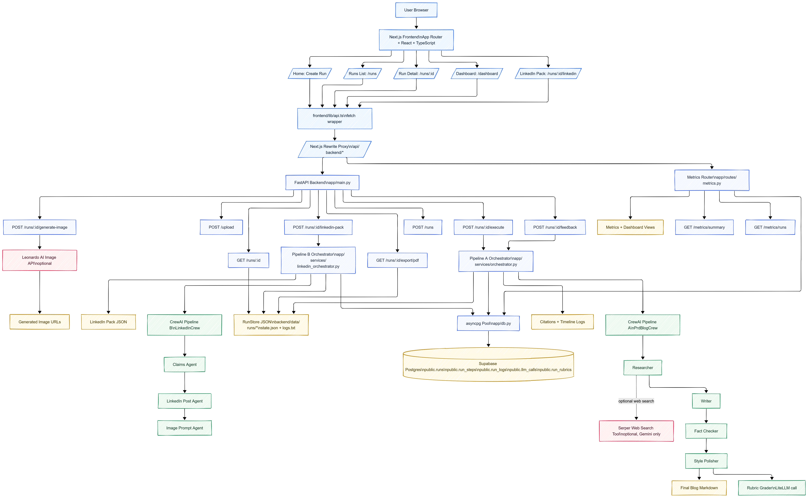
</p>
<p align="center"><em>High-level architecture of Shinrai (frontend, backend orchestration, agents, storage, and external services).</em></p>

## Architecture

```text
Frontend (Next.js)
  |  /api/backend/* (rewrite proxy)
  v
Backend (FastAPI)
  |- main routes: runs, upload, feedback, linkedin, export
  |- metrics routes: summary, runs
  |- orchestrator.py (Pipeline A)
  |- linkedin_orchestrator.py (Pipeline B)
  |- run_store.py (JSON persistence)
  |- run_repo.py (Postgres persistence + metrics)
  v
Storage
  |- Local files: state.json, logs.txt per run
  |- Supabase/Postgres: runs, run_steps, run_logs, llm_calls, run_rubrics
```

## Repository Map

```text
.
|- backend/
|  |- app/
|  |  |- main.py
|  |  |- auth.py
|  |  |- db.py
|  |  |- database/schema.sql
|  |  |- database/rls.sql
|  |  |- routes/metrics.py
|  |  |- crew/
|  |  |  |- crew.py
|  |  |  |- linkedin_crew.py
|  |  |  |- config/
|  |  |     |- agents.yaml
|  |  |     |- tasks.yaml
|  |  |     |- linkedin_agents.yaml
|  |  |     |- linkedin_tasks.yaml
|  |  |- services/
|  |  |  |- orchestrator.py
|  |  |  |- linkedin_orchestrator.py
|  |  |  |- run_store.py
|  |  |  |- run_repo.py
|  |  |  |- llm_client.py
|  |  |- tools/search_tool.py
|  |  |- utils/
|  |- requirements.txt
|- frontend/
|  |- app/
|  |  |- page.tsx
|  |  |- auth/page.tsx
|  |  |- dashboard/page.tsx
|  |  |- profile/page.tsx
|  |  |- runs/page.tsx
|  |  |- runs/[runId]/page.tsx
|  |  |- runs/[runId]/linkedin/page.tsx
|  |  |- studio/page.tsx
|  |- components/
|  |- lib/
|  |  |- api.ts
|  |  |- supabase.ts
|  |  |- types.ts
|  |  |- useRequireAuth.ts
|  |  |- runNames.ts
|  |- next.config.js
|  |- package.json
|- README.md
```

## Run Lifecycle

1. `POST /runs` creates a run (`PENDING`) and initializes JSON state.
2. Run page auto-calls `POST /runs/{run_id}/execute` for pending runs.
3. Backend executes Pipeline A:
   - researcher -> writer -> fact-check loop -> style editor
4. State and logs are written locally.
5. If DB is available, the same lifecycle is dual-written to Postgres.
6. Frontend polls `GET /runs/{run_id}` about every 3 seconds while running.
7. User can submit stage feedback via `POST /runs/{run_id}/feedback`.
8. After completion, user can download markdown, export PDF, or run Pipeline B.

## API Surface

Defined in `backend/app/main.py` and `backend/app/routes/metrics.py`.

| Method | Path | Purpose |
|---|---|---|
| `POST` | `/upload` | Extract text from uploaded file |
| `POST` | `/runs` | Create a run |
| `POST` | `/runs/{run_id}/execute` | Execute Pipeline A |
| `POST` | `/runs/{run_id}/feedback` | Re-run from selected stage with user feedback |
| `POST` | `/runs/{run_id}/linkedin-pack` | Execute Pipeline B |
| `POST` | `/runs/{run_id}/generate-image` | Generate image from LinkedIn prompt |
| `GET` | `/runs/{run_id}` | Get full run state |
| `GET` | `/runs/{run_id}/export/pdf` | Export final blog as PDF |
| `GET` | `/metrics/summary` | Aggregate metrics + daily trend |
| `GET` | `/metrics/runs?limit=...` | Per-run metrics list |

## Persistence Model

### Local JSON Store

Implemented in `backend/app/services/run_store.py`.

Per run:

- `state.json`
- `logs.txt`

State shape:

```json
{
  "run_id": "uuid",
  "inputs": {},
  "steps": {
    "research": null,
    "drafts": [],
    "fact_checks": [],
    "final": null
  },
  "citations": [],
  "feedback": [],
  "status": "PENDING|RUNNING|DONE|DONE_WITH_WARNINGS|ERROR",
  "error": null,
  "logs": []
}
```

Log line example:

```text
[2026-02-19T15:26:47+00:00] Step 2: Writer iteration 1
```

### Postgres Tables

Defined in `backend/app/database/schema.sql`.

- `public.runs`: run status, inputs, model metadata, lifecycle timestamps
- `public.run_steps`: per-step/per-iteration execution state and latency
- `public.run_logs`: structured log messages
- `public.llm_calls`: token usage and latency per LLM call
- `public.run_rubrics`: quality scores, pass/fail gate, review-required flag, thresholds, grading summary

## Database Pool and Supabase

DB lifecycle helper is in `backend/app/db.py`:

- `init_db()`: creates asyncpg pool (`min_size=1`, `max_size=5`)
- `close_db()`: closes pool on shutdown
- `is_db_ready()`: guards DB-only functionality
- `pool()`: returns shared pool

This is wired in FastAPI lifespan (`backend/app/main.py`).

Supabase setup:

1. Create Supabase project.
2. Run SQL from `backend/app/database/schema.sql`.
3. Set `DATABASE_URL` in `backend/.env`.
4. Restart backend.
5. Validate:
   - `GET /metrics/summary`
   - `GET /metrics/runs`

## Agent System

### Pipeline A Agents

Source: `backend/app/crew/config/agents.yaml`.

| Agent | Role | Goal |
|---|---|---|
| `researcher` | Product Researcher | Extract facts from PRD with source IDs |
| `writer` | Content Writer | Write blog with `[S#]` citations |
| `fact_checker` | Fact Checker | Verify claims against sources |
| `polisher` | Style Editor | Improve clarity and tone without adding facts |

Runtime behavior from `backend/app/crew/crew.py`:

- Default Groq model: `groq/llama-3.1-8b-instant`
- Default Gemini model: `gemini/gemini-2.5-flash`
- Fact-check retries: `MAX_FACT_CHECK_RETRIES = 2` (max 3 attempts total)
- Groq fallback chain on rate limit:
  - `groq/llama-3.1-8b-instant`
  - `groq/llama-3.3-70b-versatile`
  - `groq/mixtral-8x7b-32768`

### Pipeline B Agents

Source: `backend/app/crew/config/linkedin_agents.yaml`.

| Agent | Role | Goal |
|---|---|---|
| `claims_agent` | Marketing Compliance Analyst | Flag risky claims and propose safer alternatives |
| `linkedin_post_agent` | LinkedIn Content Strategist | Create 120-220 word optimized post + hashtags + CTA |
| `image_prompt_agent` | AI Image Prompt Engineer | Produce SDXL/SDXL-Lightning ready prompt package |

Runtime behavior from `backend/app/crew/linkedin_crew.py`:

- Pipeline B is forced to `groq/llama-3.1-8b-instant`.

## Prompt Inventory

Primary prompt files in this repository:

| Prompt Type | File |
|---|---|
| Pipeline A task prompts | `backend/app/crew/config/tasks.yaml` |
| Pipeline B task prompts | `backend/app/crew/config/linkedin_tasks.yaml` |
| Pipeline A agent persona prompts (role/goal/backstory) | `backend/app/crew/config/agents.yaml` |
| Pipeline B agent persona prompts (role/goal/backstory) | `backend/app/crew/config/linkedin_agents.yaml` |

Runtime prompt augmentation (not in YAML, added in code):

| Runtime Injection | File |
|---|---|
| web search instruction fragment | `backend/app/services/orchestrator.py` |
| fact-check rewrite instruction fragment | `backend/app/services/orchestrator.py` |
| feedback instruction fragments for researcher/writer/fact-checker/style editor | `backend/app/services/orchestrator.py` |
| LinkedIn pipeline placeholder prompt values | `backend/app/services/linkedin_orchestrator.py` |

## Full Prompt Files (Verbatim)

These are the exact prompt/config files used by the pipeline.

### `backend/app/crew/config/agents.yaml`

```yaml
researcher:
  role: "Product Researcher"
  goal: "Extract facts from PRD with source IDs"
  backstory: "You extract facts and return JSON with source IDs S0, S1, S2..."
  verbose: true

writer:
  role: "Content Writer"
  goal: "Write blog with [S#] citations"
  backstory: "You write blog posts and cite facts as [S1], [S2] etc."
  verbose: true

fact_checker:
  role: "Fact Checker"
  goal: "Verify claims match sources"
  backstory: "You verify claims and return JSON with passed true/false."
  verbose: true

polisher:
  role: "Style Editor"
  goal: "Improve clarity and tone"
  backstory: "You improve readability. Keep all citations [S#]. Do not add facts."
  verbose: true
```

### `backend/app/crew/config/tasks.yaml`

```yaml
research_task:
  description: >
    PRD: {prd}
    {web_search_instructions}

    Return STRICT JSON only (no prose, no markdown):
    {{
      "queries": ["q1", "q2"],
      "sources": [
        {{"id": "S0", "title": "PRD", "url": "internal://prd", "query": "internal", "key_facts": ["fact1"]}},
        {{"id": "S1", "title": "External source title", "url": "https://...", "query": "query used", "key_facts": ["fact2"]}}
      ],
      "summary_facts": ["f1", "f2"],
      "unknowns": []
    }}

    Rules:
    - Always include S0 for the PRD.
    - If web search is enabled, include at least 3 external sources (S1+), each with real http(s) URL.
    - Keep source IDs unique (S0, S1, S2...).
    - Every important claim should map to one or more source key_facts.
  expected_output: "JSON with sources array having id, title, url, key_facts"
  agent: researcher

write_task:
  description: >
    PRD: {prd}
    Research: {research_json}
    Tone: {tone}, Audience: {audience}, Words: {word_count}

    Write blog in Markdown. Cite facts as [S1], [S2]. If unsure, use [NEEDS CONFIRMATION].
    {revision_instructions}
  expected_output: "Markdown blog with [S#] citations"
  agent: writer

fact_check_task:
  description: >
    Draft: {draft}
    Research: {research_json}

    Check if claims match sources. Return JSON:
    {{"passed": true/false, "issues": [{{"claim": "x", "reason": "y", "suggested_fix": "z", "source_ids": []}}], "rewrite_instructions": ""}}
  expected_output: "JSON with passed boolean and issues array"
  agent: fact_checker

polish_task:
  description: >
    Draft: {draft}
    Tone: {tone}, Audience: {audience}

    Improve clarity. Keep [S#] citations. Do NOT add new facts.
  expected_output: "Polished Markdown with preserved citations"
  agent: polisher
```

### `backend/app/crew/config/linkedin_agents.yaml`

```yaml
# LinkedIn Pack Agents Configuration
# Pipeline B: Optional post-blog LinkedIn content generation

claims_agent:
  role: >
    Marketing Compliance Analyst
  goal: >
    Extract and flag risky marketing claims to ensure content is defensible and compliant with FTC guidelines
  backstory: >
    Identify objective claims and flag anything risky (superlatives, guarantees, unsubstantiated stats).
    Provide safer alternatives.

linkedin_post_agent:
  role: >
    LinkedIn Content Strategist
  goal: >
    Convert long-form blog content into engaging, platform-optimized LinkedIn posts with strong hooks and clear CTAs
  backstory: >
    Create 120-220 word LinkedIn posts with hooks, skimmable bullets, hashtags, and CTAs.
    Never add facts beyond the source blog. Avoid risky claims.

image_prompt_agent:
  role: >
    AI Image Prompt Engineer
  goal: >
    Generate optimized text-to-image prompts for SDXL/SDXL-Lightning that create professional marketing visuals
  backstory: >
    Craft 1-2 line prompts for marketing images. Avoid text/logos in images.
    Include negative prompts to prevent common failures.
```

### `backend/app/crew/config/linkedin_tasks.yaml`

```yaml
# LinkedIn Pack Tasks Configuration
# Pipeline B: Three-agent workflow for LinkedIn content generation

claims_check_task:
  description: >
    Analyze the final blog post and extract all marketing claims.

    Blog content: {blog_content}
    Product name: {product_name}

    Identify:
    1. SAFE CLAIMS - Statements directly supported by blog content
    2. RISKY CLAIMS - Superlatives ("best", "#1"), guarantees, health/safety claims,
       unsubstantiated statistics, performance promises

    For each risky claim, suggest safer wording alternatives:
    - "may help" instead of "will solve"
    - "designed to" instead of "guaranteed to"
    - "customers report" instead of "proven to"

    Output as JSON:
    {{
      "safe_claims": ["claim 1", "claim 2", ...],
      "risky_claims": [
        {{"claim": "original text", "risk_type": "superlative|guarantee|stat|etc", "suggestion": "safer alternative"}}
      ],
      "overall_assessment": "LOW_RISK|MEDIUM_RISK|HIGH_RISK"
    }}
  expected_output: >
    JSON object with categorized claims and compliance assessment
  agent: claims_agent

linkedin_post_task:
  description: >
    Convert the blog into a LinkedIn post optimized for engagement.

    Blog content: {blog_content}
    Target audience: {audience}
    Tone: {tone}
    Product name: {product_name}
    Goal: {goal}
    AVOID these risky claims: {risky_claims}

    Requirements:
    - Length: 120-220 words
    - Structure:
      1. Hook (1-2 sentences that grab attention)
      2. Problem statement or context
      3. Key benefits (2-4 bullet points for skimmability)
      4. Call-to-action (demo, waitlist, learn more)
    - Add 8-12 relevant hashtags (#ProductManagement #TechInnovation #AI etc.)
    - NO facts beyond the source blog
    - AVOID all flagged risky claims
    - Use safer alternatives provided

    Output as JSON:
    {{
      "post_text": "full LinkedIn post text",
      "hashtags": ["hashtag1", "hashtag2", ...],
      "cta": "specific call-to-action text",
      "word_count": 123
    }}
  expected_output: >
    JSON object with ready-to-paste LinkedIn post, hashtags, and CTA
  agent: linkedin_post_agent

image_prompt_task:
  description: >
    Generate an optimized prompt for creating a professional marketing image.

    LinkedIn post: {linkedin_post}
    Brand tone: {brand_tone}
    Product category: {product_category}
    Brand colors: {brand_colors}

    Create:
    1. Main prompt (1-2 sentences) optimized for SDXL-Lightning
       - Focus on visual concepts, not text
       - Professional marketing aesthetic
       - Incorporate brand tone and product category
       - Use colors if provided

    2. Negative prompt to avoid common failures
       - "no text, no watermarks, no logos, no words"
       - Other quality controls

    Examples of good prompts:
    - "Modern minimalist workspace with laptop showing analytics dashboard, soft blue lighting, professional photography style, clean composition"
    - "Abstract representation of AI neural network connections, vibrant purple and teal gradient, futuristic tech aesthetic, high quality render"

    Output as JSON:
    {{
      "prompt": "your optimized prompt here",
      "negative_prompt": "what to avoid",
      "model_suggestion": "SDXL-Lightning",
      "style_notes": "brief description of expected visual outcome"
    }}
  expected_output: >
    JSON object with image generation prompt optimized for SDXL
  agent: image_prompt_agent
```

## Pipeline A Prompts

Source: `backend/app/crew/config/tasks.yaml`.

<details>
<summary><code>research_task</code></summary>

```yaml
description: >
  PRD: {prd}
  {web_search_instructions}

  Return STRICT JSON only (no prose, no markdown):
  {{
    "queries": ["q1", "q2"],
    "sources": [
      {{"id": "S0", "title": "PRD", "url": "internal://prd", "query": "internal", "key_facts": ["fact1"]}},
      {{"id": "S1", "title": "External source title", "url": "https://...", "query": "query used", "key_facts": ["fact2"]}}
    ],
    "summary_facts": ["f1", "f2"],
    "unknowns": []
  }}

  Rules:
  - Always include S0 for the PRD.
  - If web search is enabled, include at least 3 external sources (S1+), each with real http(s) URL.
  - Keep source IDs unique (S0, S1, S2...).
  - Every important claim should map to one or more source key_facts.
expected_output: "JSON with sources array having id, title, url, key_facts"
agent: researcher
```

</details>

<details>
<summary><code>write_task</code></summary>

```yaml
description: >
  PRD: {prd}
  Research: {research_json}
  Tone: {tone}, Audience: {audience}, Words: {word_count}

  Write blog in Markdown. Cite facts as [S1], [S2]. If unsure, use [NEEDS CONFIRMATION].
  {revision_instructions}
expected_output: "Markdown blog with [S#] citations"
agent: writer
```

</details>

<details>
<summary><code>fact_check_task</code></summary>

```yaml
description: >
  Draft: {draft}
  Research: {research_json}

  Check if claims match sources. Return JSON:
  {{"passed": true/false, "issues": [{{"claim": "x", "reason": "y", "suggested_fix": "z", "source_ids": []}}], "rewrite_instructions": ""}}
expected_output: "JSON with passed boolean and issues array"
agent: fact_checker
```

</details>

<details>
<summary><code>polish_task</code></summary>

```yaml
description: >
  Draft: {draft}
  Tone: {tone}, Audience: {audience}

  Improve clarity. Keep [S#] citations. Do NOT add new facts.
expected_output: "Polished Markdown with preserved citations"
agent: polisher
```

</details>

Pipeline A orchestration (`backend/app/services/orchestrator.py`):

- Run status is set to `RUNNING` at start.
- Web search tool is injected only when:
  - `use_web_search=true`
  - provider is Gemini
  - `SERPER_API_KEY` exists
- Research output is parsed/validated before downstream use.
- Citations are derived from research sources and persisted.
- Writer/fact-check loop runs up to 3 total attempts.
- Final status:
  - `DONE` if fact-check eventually passes
  - `DONE_WITH_WARNINGS` if retries are exhausted
- DB instrumentation (when DB ready):
  - `step_start()`, `step_end()`, `log_llm_call()`

## Pipeline B Prompts

Source: `backend/app/crew/config/linkedin_tasks.yaml`.

<details>
<summary><code>claims_check_task</code></summary>

```yaml
description: >
  Analyze the final blog post and extract all marketing claims.

  Blog content: {blog_content}
  Product name: {product_name}

  Identify:
  1. SAFE CLAIMS - Statements directly supported by blog content
  2. RISKY CLAIMS - Superlatives ("best", "#1"), guarantees, health/safety claims,
     unsubstantiated statistics, performance promises

  For each risky claim, suggest safer wording alternatives:
  - "may help" instead of "will solve"
  - "designed to" instead of "guaranteed to"
  - "customers report" instead of "proven to"

  Output as JSON:
  {{
    "safe_claims": ["claim 1", "claim 2", ...],
    "risky_claims": [
      {{"claim": "original text", "risk_type": "superlative|guarantee|stat|etc", "suggestion": "safer alternative"}}
    ],
    "overall_assessment": "LOW_RISK|MEDIUM_RISK|HIGH_RISK"
  }}
expected_output: >
  JSON object with categorized claims and compliance assessment
agent: claims_agent
```

</details>

<details>
<summary><code>linkedin_post_task</code></summary>

```yaml
description: >
  Convert the blog into a LinkedIn post optimized for engagement.

  Blog content: {blog_content}
  Target audience: {audience}
  Tone: {tone}
  Product name: {product_name}
  Goal: {goal}
  AVOID these risky claims: {risky_claims}

  Requirements:
  - Length: 120-220 words
  - Structure:
    1. Hook (1-2 sentences that grab attention)
    2. Problem statement or context
    3. Key benefits (2-4 bullet points for skimmability)
    4. Call-to-action (demo, waitlist, learn more)
  - Add 8-12 relevant hashtags (#ProductManagement #TechInnovation #AI etc.)
  - NO facts beyond the source blog
  - AVOID all flagged risky claims
  - Use safer alternatives provided

  Output as JSON:
  {{
    "post_text": "full LinkedIn post text",
    "hashtags": ["hashtag1", "hashtag2", ...],
    "cta": "specific call-to-action text",
    "word_count": 123
  }}
expected_output: >
  JSON object with ready-to-paste LinkedIn post, hashtags, and CTA
agent: linkedin_post_agent
```

</details>

<details>
<summary><code>image_prompt_task</code></summary>

```yaml
description: >
  Generate an optimized prompt for creating a professional marketing image.

  LinkedIn post: {linkedin_post}
  Brand tone: {brand_tone}
  Product category: {product_category}
  Brand colors: {brand_colors}

  Create:
  1. Main prompt (1-2 sentences) optimized for SDXL-Lightning
     - Focus on visual concepts, not text
     - Professional marketing aesthetic
     - Incorporate brand tone and product category
     - Use colors if provided

  2. Negative prompt to avoid common failures
     - "no text, no watermarks, no logos, no words"
     - Other quality controls

  Examples of good prompts:
  - "Modern minimalist workspace with laptop showing analytics dashboard, soft blue lighting, professional photography style, clean composition"
  - "Abstract representation of AI neural network connections, vibrant purple and teal gradient, futuristic tech aesthetic, high quality render"

  Output as JSON:
  {{
    "prompt": "your optimized prompt here",
    "negative_prompt": "what to avoid",
    "model_suggestion": "SDXL-Lightning",
    "style_notes": "brief description of expected visual outcome"
  }}
expected_output: >
  JSON object with image generation prompt optimized for SDXL
agent: image_prompt_agent
```

</details>

Pipeline B orchestration (`backend/app/services/linkedin_orchestrator.py`):

- Requires Pipeline A completion (`DONE` or `DONE_WITH_WARNINGS`)
- Runs claims -> post -> image prompt sequence
- Writes output to `state.linkedin_pack`
- Appends stage logs to run logs
- Optional image generation via `POST /runs/{run_id}/generate-image`

## Runtime Prompt Fragments

These are exact additional prompt strings injected at runtime.

### Web Search Fragment (Pipeline A)

Source: `backend/app/services/orchestrator.py`

```text
Web search is ENABLED. Use the search tool to find current, reputable external sources. Include at least 3 external sources as S1+ with real URLs.
```

### Fact-Check Retry Rewrite Fragment

Source: `backend/app/services/orchestrator.py`

```text
--- REVISION REQUIRED (iteration {iteration}) ---
The fact-checker found issues. Rewrite instructions:
{fc_rewrite}

Issues:
{json.dumps(fc_issues, indent=2)}

Please fix ALL issues and ensure every claim is cited with [S#].
```

### Feedback Fragments (Re-run Path)

Source: `backend/app/services/orchestrator.py`

Researcher feedback injection:

```text
USER FEEDBACK:
{feedback}

Please incorporate this feedback in your research.
```

Writer feedback injection:

```text
--- USER FEEDBACK ---
{feedback}

Please incorporate this feedback and revise accordingly.
```

Fact-checker feedback injection:

```text
USER FEEDBACK:
{feedback}

Please pay special attention to these concerns.
```

Style editor feedback injection:

```text
USER FEEDBACK:
{feedback}

Please incorporate this styling feedback.
```

### LinkedIn Pipeline Placeholder Inputs

Source: `backend/app/services/linkedin_orchestrator.py`

```text
risky_claims = "No risky claims identified yet"
linkedin_post = "Will be generated by previous task"
```

## Rubric Quality Gate

Rubric scoring is executed after style polishing in `backend/app/services/orchestrator.py`.

- Scoring dimensions:
  - `clarity` (1-5)
  - `correctness` (1-5)
  - `completeness` (1-5)
  - `overall` (1-5)
- Default thresholds (env-configurable):
  - `RUBRIC_MIN_CLARITY=3`
  - `RUBRIC_MIN_CORRECTNESS=4`
  - `RUBRIC_MIN_COMPLETENESS=3`
  - `RUBRIC_MIN_OVERALL=3.5`
  - `RUBRIC_MAX_RETRIES=1`
- Gate behavior:
  - If rubric passes, run can finish as `DONE` (if fact-check also passed).
  - If rubric fails, orchestrator rolls back to Writer -> Fact-Checker -> Style and retries.
  - If still below threshold after retries, run is marked `DONE_WITH_WARNINGS` with `review_required=true`.
- Persistence:
  - Scores and gate results are stored in `public.run_rubrics`.
- UI:
  - Run detail page shows rubric score cards and gate state.
  - `/dashboard` and `/runs` include rubric metrics per run and aggregated quality stats.

## Observability and Metrics

### Local and API Logs

- Pipeline events are appended to `state.logs` and `logs.txt`.
- Run detail page (`frontend/app/runs/[runId]/page.tsx`) renders logs in a collapsible console block.
- Feedback re-runs are logged.

### DB Observability

`backend/app/services/run_repo.py` records:

- run lifecycle transitions in `public.runs`
- step boundaries in `public.run_steps`
- message logs in `public.run_logs`
- LLM token/latency usage in `public.llm_calls`
- rubric quality outcomes in `public.run_rubrics`

### Metrics API Outputs

`GET /metrics/summary`:

- `headline.total_runs`
- `headline.completed_runs`
- `headline.avg_duration_ms`
- `headline.prompt_tokens`
- `headline.completion_tokens`
- `headline.total_tokens`
- `headline.avg_llm_latency_ms`
- `headline.rubric_avg_overall`
- `headline.rubric_scored_runs`
- `headline.rubric_passed_runs`
- `headline.rubric_pass_rate`
- `daily[]` trend (day, runs, errors for last 14 days)

`GET /metrics/runs?limit=N`:

- run id/status/model metadata
- web-search flag
- created timestamp
- duration
- aggregated token totals
- average LLM latency
- llm call count
- rubric scores and gate fields:
  - `rubric_clarity_score`
  - `rubric_correctness_score`
  - `rubric_completeness_score`
  - `rubric_overall_score`
  - `rubric_passed`
  - `rubric_review_required`

## Screenshots

<p align="center">
  
</p>
<p align="center"><em>Landing page overview with workflow, pricing, and CTA sections.</em></p>

<p align="center">
  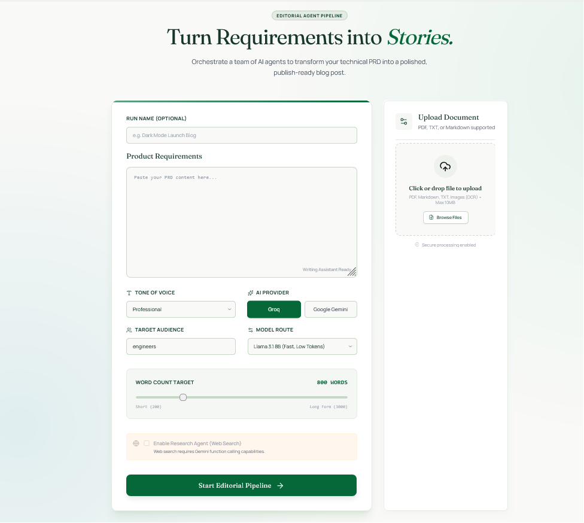
</p>
<p align="center"><em>Studio page for PRD input, model selection, run naming, and pipeline launch.</em></p>

<p align="center">
  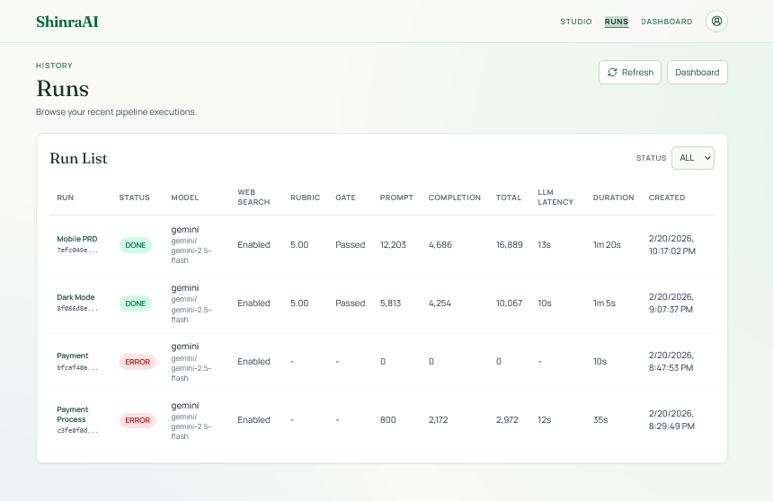
</p>
<p align="center"><em>Runs history page with per-run status, rubric, token, latency, and duration metrics.</em></p>

<p align="center">
  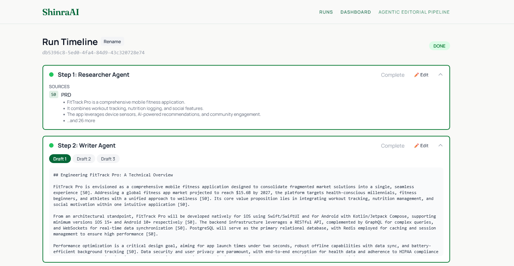
</p>
<p align="center"><em>Run timeline showing the multi-agent flow and stage-by-stage progression.</em></p>

<p align="center">
  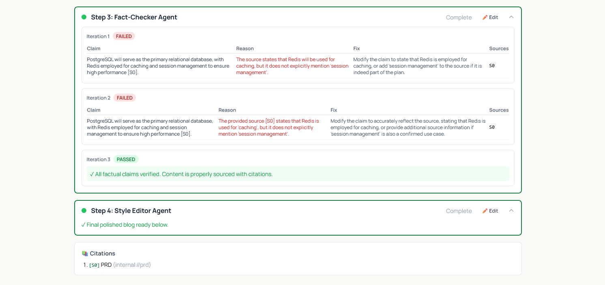
</p>
<p align="center"><em>Expanded timeline panels with detailed per-step outputs.</em></p>

<p align="center">
  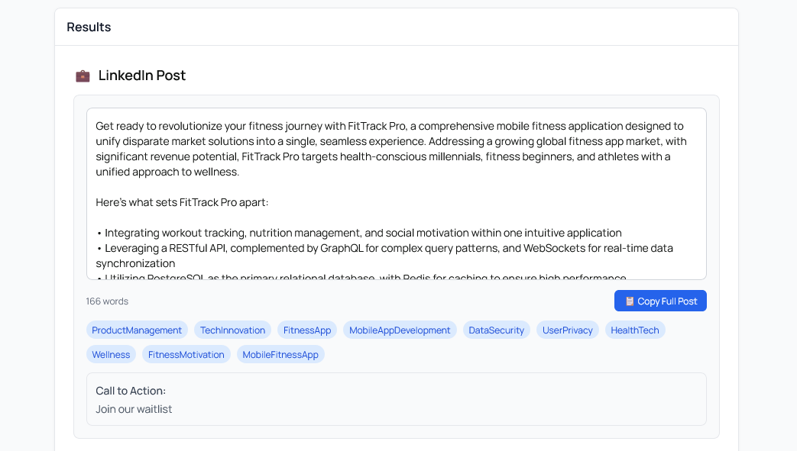
</p>
<p align="center"><em>LinkedIn caption generation output from Pipeline B.</em></p>

<p align="center">
  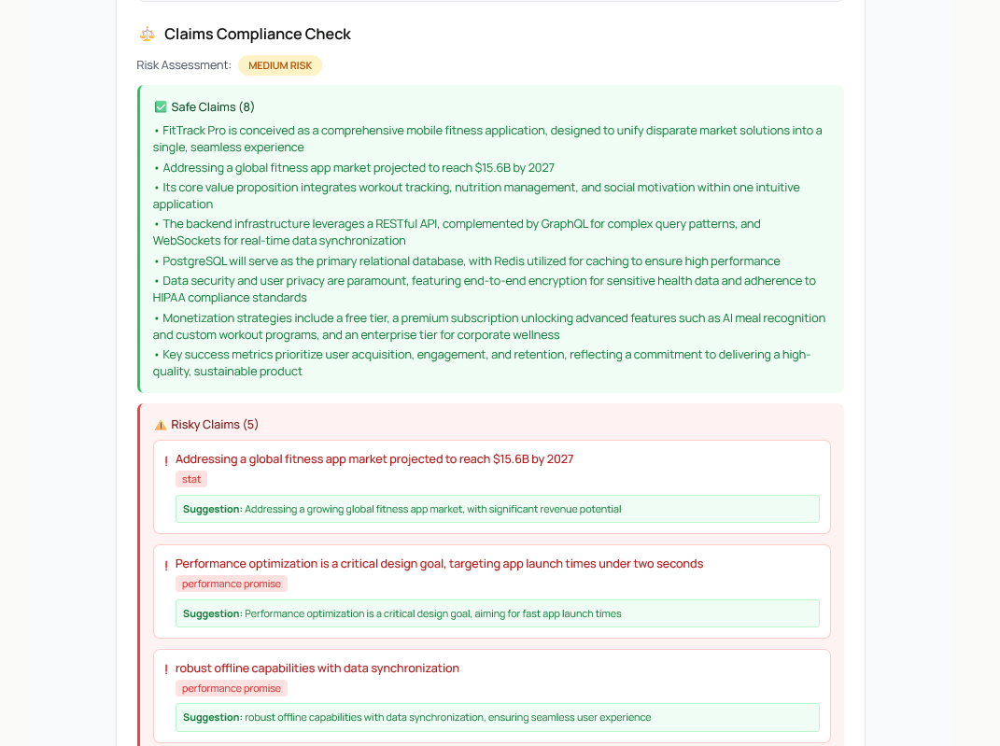
</p>
<p align="center"><em>Claims analysis stage highlighting safe and risky claims.</em></p>

<p align="center">
  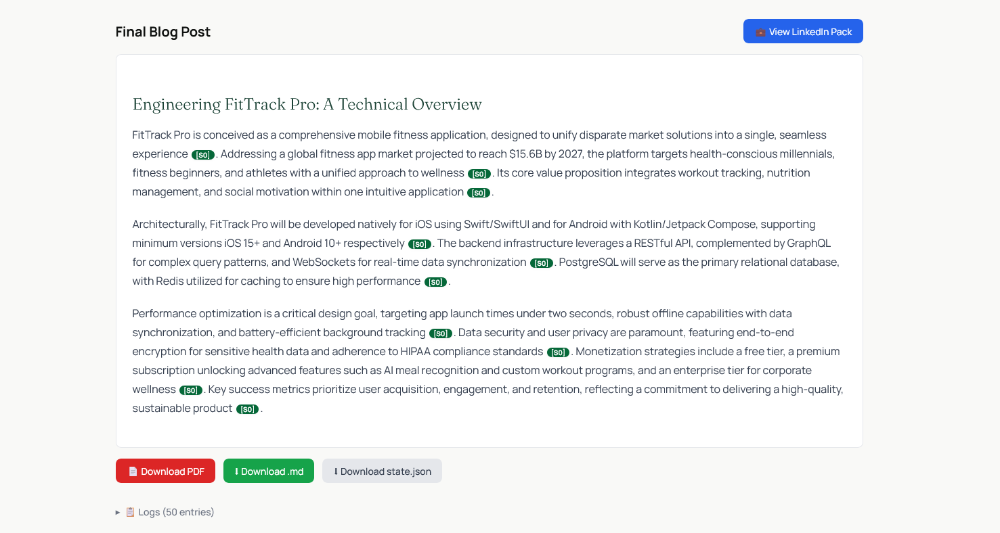
</p>
<p align="center"><em>Final polished blog post with inline citation markers.</em></p>

<p align="center">
  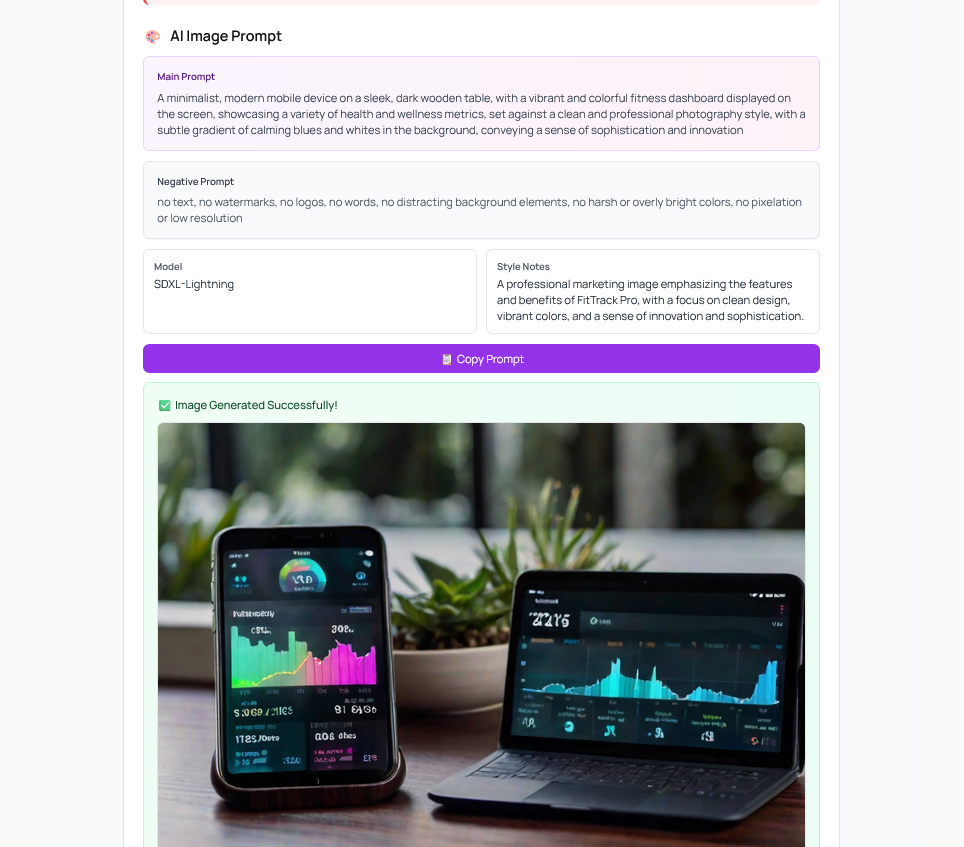
</p>
<p align="center"><em>Image generation stage using the generated marketing prompt.</em></p>

<p align="center">
  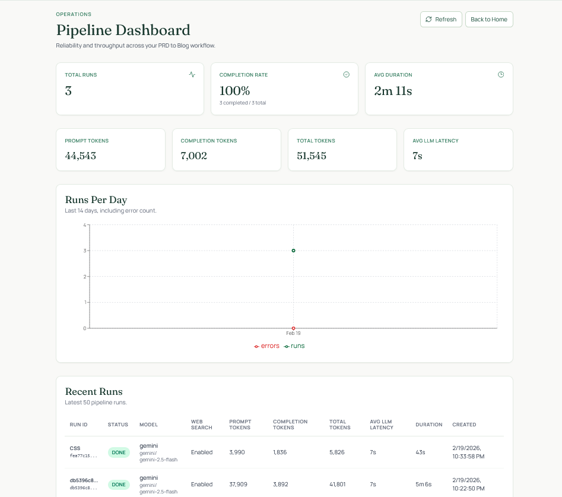
</p>
<p align="center"><em>Operations dashboard showing KPI tiles, runs/errors trend, and recent run analytics.</em></p>

<p align="center">
  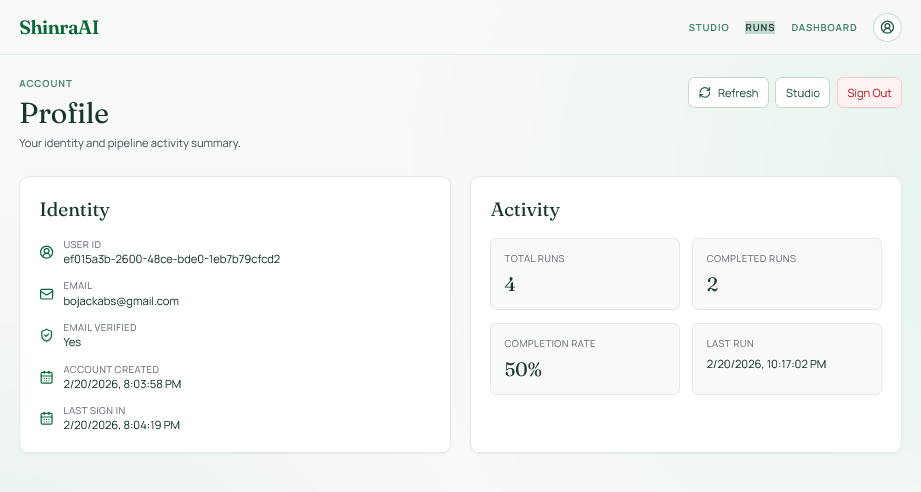
</p>
<p align="center"><em>Profile page with authenticated user details and account activity summary.</em></p>

<p align="center">
  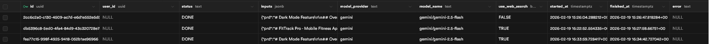
</p>
<p align="center"><em>Supabase `run_logs` records for timeline and debugging observability.</em></p>

<p align="center">
  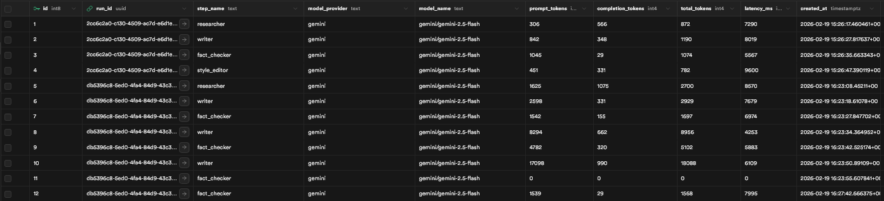
</p>
<p align="center"><em>Supabase `llm_calls` metrics including prompt/completion/total tokens and latency.</em></p>

<p align="center">
  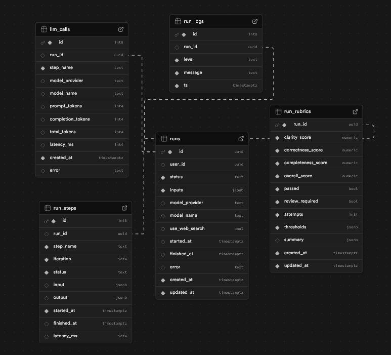
</p>
<p align="center"><em>Database relationship diagram for run, step, log, LLM call, and rubric entities.</em></p>

## Frontend Experience


### Studio (`frontend/app/studio/page.tsx`)

- PRD input
- optional run name (UI-only localStorage)
- tone/audience/word count controls
- model provider + model selection
- web search toggle (Gemini only)
- template library + file upload

### Auth (`frontend/app/auth/page.tsx`)

- sign in
- sign up
- forgot password
- password reset flow

### Profile (`frontend/app/profile/page.tsx`)

- authenticated account details
- activity summary (runs/completion/last run)
- sign-out action from profile and header menu

### Run Detail (`frontend/app/runs/[runId]/page.tsx`)

- auto-executes pending runs
- polls run state
- timeline view by step
- stage feedback modal and selective re-run
- final markdown + citations
- downloads: PDF, markdown, full state JSON
- full run logs

### Runs List (`frontend/app/runs/page.tsx`)

- metrics-backed table
- status filter
- per-run model/tokens/latency/duration columns
- local run name overlay from `runNames.ts`

### Dashboard (`frontend/app/dashboard/page.tsx`)

- redesigned KPI tiles and visual hierarchy
- token and latency summaries
- improved 14-day runs/errors chart panel
- upgraded recent runs metrics table

### LinkedIn Page (`frontend/app/runs/[runId]/linkedin/page.tsx`)

- triggers Pipeline B
- polls for linkedIn pack updates
- displays claims, post, image prompt, generated images

## Frontend API Client

Source: `frontend/lib/api.ts`.

- API base: `/api/backend`
- rewrite target in `frontend/next.config.js`:
  - `${BACKEND_URL || "http://localhost:8000"}`
- implemented client functions:
  - `createRun`
  - `executeRun`
  - `getRun`
  - `submitFeedback`
  - `generateLinkedInPack`
  - `generateImage`
  - `downloadPdf`
  - `getMetricsSummary`
  - `getMetricsRuns`

## Setup

### Backend

```bash
cd backend
python -m venv .venv
.venv\Scripts\Activate.ps1
pip install -r requirements.txt
copy .env.example .env
uvicorn app.main:app --reload --port 8000
```

Key backend env vars:

| Variable | Required | Purpose |
|---|---|---|
| `GROQ_API_KEY` | Yes* | Groq model access |
| `GEMINI_API_KEY` / `GOOGLE_API_KEY` | Yes* | Gemini model access |
| `MODEL` | No | Default model override |
| `SERPER_API_KEY` | For web search | Research web tool |
| `DATABASE_URL` | For metrics DB mode | Supabase/Postgres connection |
| `SUPABASE_URL` | Recommended | JWKS token verification fallback |
| `SUPABASE_JWT_SECRET` | Optional | HS256 token verification |
| `LEONARDO_API_KEY` | For image generation | Leonardo API |

\* At least one provider family is required (Groq or Gemini).

### Frontend

```bash
cd frontend
npm install
npm run dev
```

`frontend/.env.local`:

```env
BACKEND_URL=http://localhost:8000
NEXT_PUBLIC_SUPABASE_URL=https://your-project-ref.supabase.co
NEXT_PUBLIC_SUPABASE_ANON_KEY=your_supabase_anon_key
```

## Security Note

Do not commit real secrets. Keep real API keys in local/private `.env` files and use placeholders in `.env.example`.

